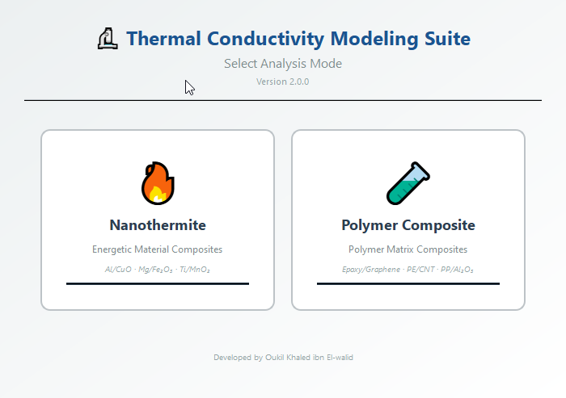
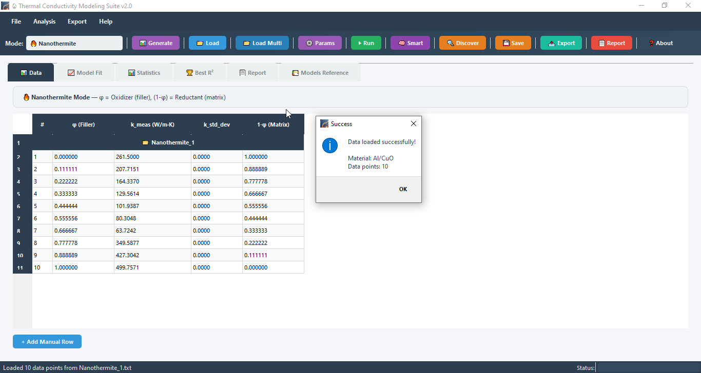
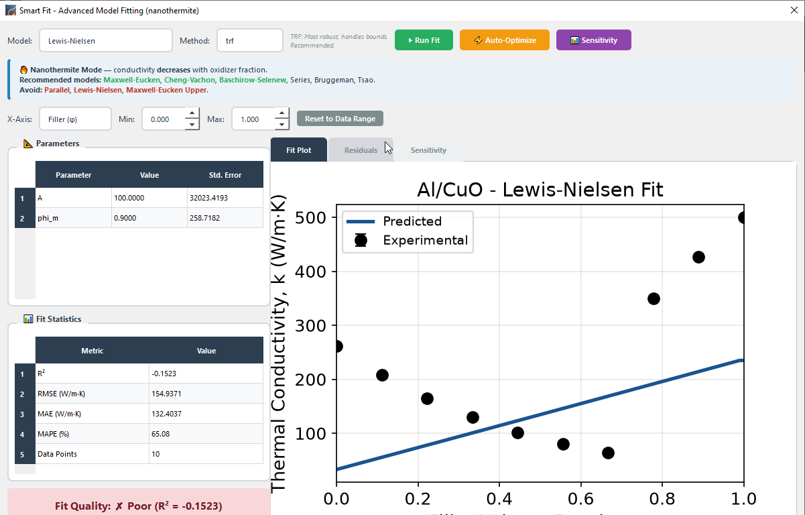
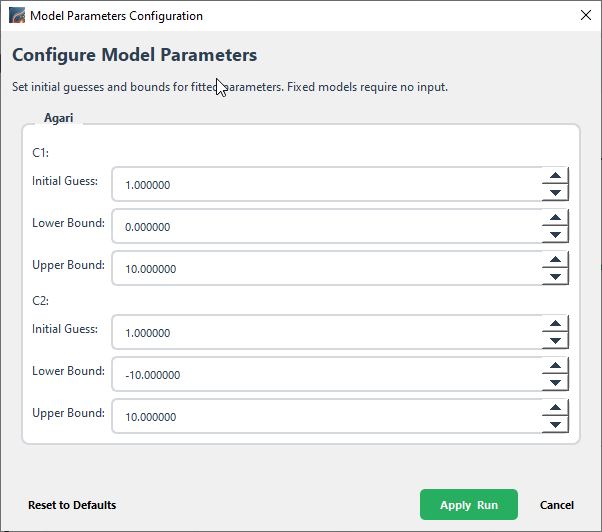
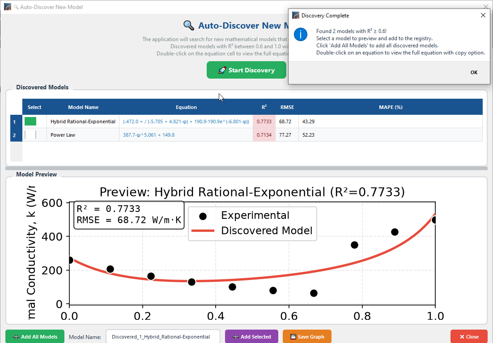
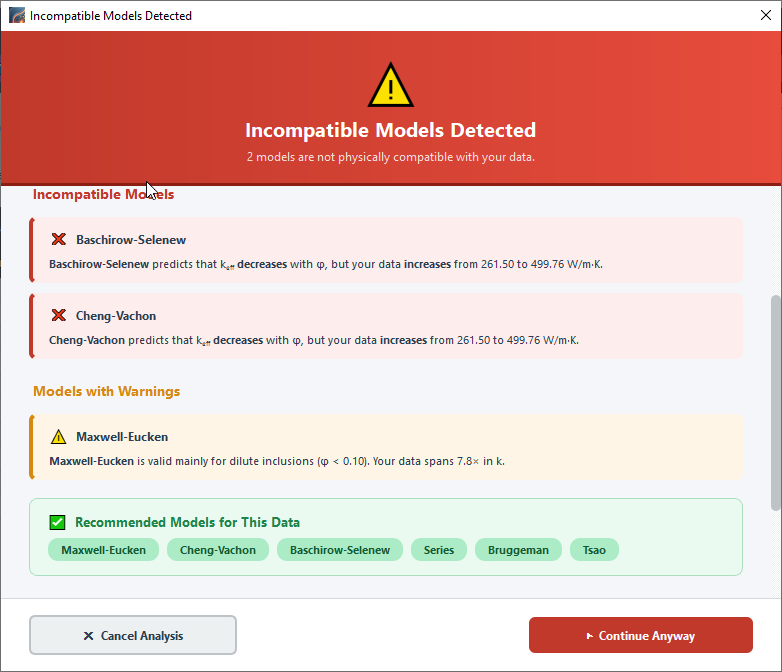

# 🔬 Thermal Conductivity Modeling Suite v2.0

Professional desktop application for experimental data analysis and modeling of thermal conductivity of composite materials.


---

## 📊 Overview

The **Thermal Conductivity Modeling Suite** is a professional desktop application designed for researchers, scientists, and engineers working with composite materials. It provides advanced tools for:

- **Experimental data analysis** of thermal conductivity measurements
- **Model fitting** with 25+ thermal conductivity models
- **Auto-discovery** of new mathematical models
- **Compatibility checking** — validates models against data trend
- **Multi-file analysis** for batch processing
- **Publication-ready plots** with journal presets
- **Professional PDF report generation**

---

## 📸 Screenshots

### 1. Mode Selection

*Choose between Nanothermite and Polymer Composite analysis modes.*

### 2. Main Window

*Load experimental data, select models, and run analysis.*

### 3. Smart Fit

*Advanced interactive model fitting with real-time hints.*

### 4. Model Parameter Configuration

*Set custom initial guesses and bounds for each fitted model.*

### 5. Auto-Discover New Models

*Automatically find mathematical models that fit your data.*

### 6. Incompatible Models Detected

*Scientific validation of model physics against your data.*

---

## ✨ Features

### 📐 Thermal Conductivity Models

| Category | Models |
|----------|--------|
| **Basic** | Parallel, Series, Maxwell-Eucken, Bruggeman, Agari, Lewis-Nielsen, Percolation, Agari-Percolation |
| **Classic** | Russell, Cheng-Vachon, Baschirow-Selenew, Hamilton-Crosser, EMT Equation, Geometric Mean, Böttcher, De Loor, Ce Wen Nan |
| **Advanced** | Rayleigh, Halpin-Tsai, Hatta, Modified Hashin-Shtrikman, Tsao, Hamilton-Crosser Extended, Maxwell-Eucken Upper/Lower, GEM Equation |
| **Auto-Discovered** | AI-driven model discovery from your experimental data |

### 🔄 Dual Mode Support

| Feature | Nanothermite Mode 🔥 | Polymer Mode 🧪 |
|---------|---------------------|-----------------|
| Matrix | Reductant (Al, Mg, Ti, etc.) | Polymer Matrix (Epoxy, PE, PP, etc.) |
| Filler | Oxidizer (CuO, Fe₂O₃, etc.) | Conductive Filler (Graphene, CNT, etc.) |
| Trend | DECREASING with φ | INCREASING with φ |
| k_matrix | ~237 W/m·K (Al) | ~0.2 W/m·K (Epoxy) |
| k_filler | ~33 W/m·K (CuO) | ~300 W/m·K (Graphene) |
| **Default models** | Maxwell-Eucken, Cheng-Vachon, Baschirow-Selenew | Agari, Lewis-Nielsen, Maxwell-Eucken |

### ✅ Model Compatibility Checker

Before running analysis, the app validates that each selected model is **physically compatible** with your data:

- ✅ **Direction check** — model trend vs. data trend
- ✅ **Material sanity** — k_matrix vs. k_filler consistency
- ✅ **Dilute limit** — warns when φ exceeds model validity
- ✅ **Percolation** — checks data range above threshold
- ✅ **Mode-specific rules** — different rules for polymer vs. nanothermite

If incompatible models are detected, a **professional dialog** explains **why** (with actual numbers) and recommends alternatives.

### 📊 Data Management
- Load from TXT, CSV, XLSX files
- Multiple file support with batch analysis
- Manual data entry and editing
- Data validation and preprocessing

### 📈 Visualization
- Publication-ready plots with 8+ journal styles (Thermochimica Acta, IJHMT, Nature, Colorblind…)
- Interactive plot navigation (zoom, pan, save)
- Residual plots with statistical analysis
- Log/linear Y-axis toggle

### 📝 Reporting
- Professional PDF report generation
- Export to Excel, CSV
- High-quality image export (PNG, PDF, SVG, TIFF — 600 DPI)

---

## 🛠️ Installation

### Prerequisites
- Python 3.10 or higher
- pip package manager

### Option 1: From Source

```bash
git clone https://github.com/khadev/Thermal-Conductivity-Modeling.git
cd Thermal-Conductivity-Modeling
pip install -r requirements.txt
python run.py
```

### Option 2: Standalone Executable

Build a single `.exe` file with PyInstaller:

```bash
python -m PyInstaller --onefile --windowed --name "ThermalConductivityModeling" --icon "app.ico" --add-data "src;src" --add-data "app.ico;." --collect-all PyQt6 --collect-all numpy --collect-all scipy --collect-all pandas --collect-all matplotlib --collect-all openpyxl --collect-all xlsxwriter --collect-all reportlab --hidden-import matplotlib.backends.backend_qt5agg --hidden-import scipy.optimize --hidden-import scipy.stats --strip src/thermal_conductivity/main.py
```

The exe will be in `dist/ThermalConductivityModeling.exe`.

---

## 📖 Usage

### Quick Start

1. **Launch the application**:
   ```bash
   python run.py
   ```

2. **Select your mode**:
   - 🔥 **Nanothermite** — for metal/oxide composites (Al/CuO)
   - 🧪 **Polymer Composite** — for polymer composites (Epoxy/Graphene)

3. **Load your data**:
   - Click "📂 Load" and select your data file
   - Format: columns for φ (filler volume fraction) and k_meas

4. **Select models**:
   - Default models are pre-selected for your mode
   - Models with green checkmarks are recommended

5. **Run analysis**:
   - Click "▶ Run" to fit all selected models
   - If a model is incompatible, a dialog explains why

6. **Export results**:
   - Save graphs, export to Excel/CSV, or generate PDF reports

### Data Format

Your data file should be tab-separated or comma-separated:

| Column | Description | Required |
|--------|-------------|----------|
| phi | Filler volume fraction (0-1) | ✅ |
| k_meas | Thermal conductivity (W/m·K) | ✅ |
| k_std_dev | Standard deviation | Optional |

Example:
```
phi    k_meas    k_std_dev
0.0    0.2       0.01
0.05   1.5       0.02
0.10   5.0       0.03
```

---

## 🧪 Data Generation

The application includes a built-in synthetic data generator:

1. Click "📊 Generate" in the toolbar
2. Select mode and material
3. Configure noise and outliers
4. Generate and save synthetic data

### Polymer Composite Presets
- 📚 **Teaching** — noise-free ideal data
- 📊 **Realistic Data** — with typical noise
- 🔬 **Research Grade** — high-quality data
- 📈 **Percolation Effect** — shows percolation threshold

---

## 📁 Project Structure

```
Thermal-Conductivity-Modeling/
├── src/
│   └── thermal_conductivity/
│       ├── core/
│       │   ├── models.py                 # Thermal conductivity models
│       │   ├── optimizer.py              # Fitting engine
│       │   ├── statistics.py             # Statistical metrics
│       │   ├── data_loader.py            # Data loading
│       │   ├── material_constants.py     # Material database
│       │   └── model_compatibility.py    # Compatibility checker
│       ├── gui/
│       │   ├── main_window.py            # Main window
│       │   ├── mode_selector.py          # Mode selection
│       │   ├── data_dialog.py            # Data loading
│       │   ├── parameter_dialog.py       # Parameter config
│       │   ├── smart_fit_dialog.py       # Smart Fit
│       │   ├── model_discovery_dialog.py # Model discovery
│       │   ├── compatibility_dialog.py   # Compatibility popup
│       │   └── generate_data_dialog.py   # Data generator
│       ├── visualization/
│       │   ├── plotter.py                # Plotting
│       │   └── styles.py                 # Journal styles
│       ├── export/
│       │   ├── exporter.py               # Excel/CSV export
│       │   └── report_generator.py       # PDF reports
│       └── main.py                       # Entry point
├── screenshots/                          # Application screenshots
├── tests/                                # Unit tests
├── app.ico                               # Application icon
├── run.py                                # Quick start
├── requirements.txt                      # Dependencies
├── pyproject.toml                        # Project metadata
└── README.md                             # This file
```

---

## 🔧 Dependencies

- **PyQt6** — GUI framework
- **NumPy** — Numerical computing
- **SciPy** — Optimization and curve fitting
- **Pandas** — Data management
- **Matplotlib** — Plotting
- **ReportLab** — PDF generation
- **OpenPyXL / XlsxWriter** — Excel export
- **Pillow** — Image processing

---

## 👨‍💻 Developer

**Oukil Khaled ibn El-walid**

- 📧 Email: oukil.khaled@gmail.com
- 🔬 Research: Thermal conductivity of composite materials

---

## 📝 License

This project is licensed under the MIT License — see the [LICENSE](LICENSE) file for details.

---

## 🙏 Acknowledgments

Thermal conductivity models are based on established literature:

- Hashin & Shtrikman (1962) — Bounds
- Maxwell (1873), Eucken (1932) — Maxwell-Eucken
- Bruggeman (1935) — Effective Medium
- Agari et al. (1993) — Agari model
- Lewis & Nielsen (1970) — Lewis-Nielsen model
- McLachlan et al. (1990) — GEM equation

---

## 📊 Citation

If you use this software in your research, please cite:

```bibtex
@software{ThermalConductivityModeling2026,
  author  = {Oukil Khaled ibn El-walid},
  title   = {Thermal Conductivity Modeling Suite},
  year    = {2026},
  version = {2.0},
  url     = {https://github.com/khadev/Thermal-Conductivity-Modeling}
}
```

---

## 🔒 Version History

### v2.0.0 (Current)
- ✅ Model compatibility checker with scientific validation
- ✅ Professional compatibility dialog
- ✅ Mode-specific default models
- ✅ Fixed Smart Fit "Residuals are not finite" error
- ✅ Icon support in PyInstaller builds
- ✅ 25+ thermal conductivity models

### v1.0.0 (Initial Release)
- ✅ 8+ thermal conductivity models
- ✅ Dual mode support (Nanothermite & Polymer)
- ✅ Publication-ready plots
- ✅ Multi-file analysis
- ✅ PDF report generation
```